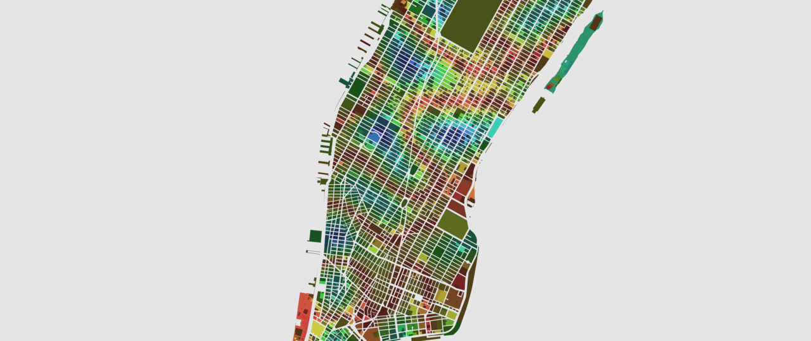
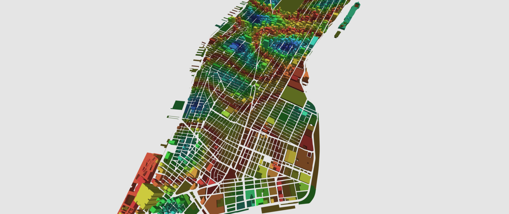

# Rendering Demo for Carto

 

### Live demo:
[https://danielesteban.github.io/CartoDemo/](https://danielesteban.github.io/CartoDemo/)

## Dev environment:

* Install dependencies: `yarn install`
* Start dev server: `yarn run start`
* Visit: [http://localhost:8080](http://localhost:8080)

## Production build:

* Install dependencies: `yarn install`
* Build production bundle: `yarn run build`
* Output will be at `./dist/`
